# 🕸️ Arachnaradio

**Arachnaradio** is a Python-based tool for capturing, identifying, and archiving content from live radio streams. It’s designed to help listeners rediscover the serendipity of real radio, while surfacing songs and interviews that align with their personal taste.

---

## 🧠 Inspiration

This project was inspired by a serendipitous moment I had while listening to KALX Berkeley in my car on my way home from work, where I happened to catch the tail end of a live interview with folk legend Bridget St. John. While tuned to 90.7FM and stuck in 580 traffic on this fateful day, I was actually leaving work early due to illness, so I was not listening during my typical timeframe. After texting a friend about the St. John interview that was airing live, I wondered, *"How many interviews with my favorite artists am I missing because I simply didn't know they were happening?"* Rhetorical question-- the answer is of course: a lot!

This lead me to want to develop an app that would ...
1. :radio:  **Connect people to their local radiostations based on their own personal music taste profile**

    I love my local radio stations here in the Bay. In the era of streaming services a la Spotify and Apple Music, bonafide radio stations are at risk of falling to the wayside. At the same time, I do believe that many people would be willing and excited to find new music on their local radio stations if they knew *how* to find a station that matches their taste. Therein lies the grounds for Goal #1 of Arachnaradio: Take a user's existing music taste data (last.fm, spotify, apple music, etc.) and suggest local radio stations customized to the user's interests.

2. 🕷️ **Provide realtime notifications when a favorite artist is mentioned on air:**

   During non-music segments of a radio broadcast, Arachnaradio will be listening quietly for mentions of a user's favorite artists by name... Once an artist mention is caught in its web, a notification will go out to the user, categorizing the mention as either a) a live interview airing on channel XY.Z FM, b) information about local live shows with that artist, or c) something else that doesn't fit those two criteria! Tentatively, this feature is to be called a ⚡ *tingle* 🕸️ (yes I am leaning heavily into the spider imagery here. Let me have fun.)

3. 🧵 **Transcribe live artist interviews to create a cultural archive for fans, journalists, and music historians of the future:**

   This is the most ambitious aspect that will be implemented, but also the most important. Especially for smaller radio stations and indie artists, interviews are often lost to time. Creating a cumulative archive of artist interviews will require AI transcription of interviews following live detection of an artist's name on air, as well as an efficient way to store these transcripts so that they may be accessed by anyone. 

--- 

## Preliminary Usage Examples: User Dashboard

The screenshots below highlight features of the current Arachnaradio user dashboard. Logged-in users can view real-time matches between their tracked artists and recent radio broadcasts, as well as a geographic map of venue mentions pulled from transcribed radio content. Spotify integration allows for personalized tracking, while fuzzy matching and geocoding help align raw radio data with known venue and artist databases.


Matched tracks for a user’s tracked artists across multiple stations, including timestamp, title, album, and label data.


Interactive venue map showing mentions of tracked artists at specific locations, enriched with event details, source stations, and playback links.


## 🎯 Current Project Milestones

- [x] Stream and save live radio audio (KALX)
- [x] Identify music clips via audio recognition (ACRCloud or AudD)
- [x] Transcribe speech using Whisper
- [x] Detect mentions of artists from user's listening history
- [x] Notify or log when relevant content is detected
- [ ] Clean up clips after parsing to manage storage

---

## 🚀 How to Run

1. Clone the repo and create a virtual environment:
   ```bash
   python3 -m venv venv
   source venv/bin/activate
   pip install -r requirements.txt
   ```

2. Start capturing radio clips:
    ```bash
    python arachnaradio/stream_capture_to_recog.py
    ```

---
## 🛠️ Dependencies
ffmpeg (must be installed system-wide)

Python packages:

    pydub

    requests

    python-dotenv

See requirements.txt for a full list.

---

## 💭 Ideas / Future Features
- [x] Log song IDs
- [x] Log artist mentions from a user provided list
- [x] Log venue mentions from a user provided list
- [x] Map venue mentions on dashboard
- [x] Compare identified songs to user’s Spotify profile
- [ ] Trigger push/email/desktop notifications for matches
- [x] Web dashboard for browsing matches and logs
- [ ] Archive and index interviews with full transcripts
- [ ] “Trending artists by song appearance on radio station X"
- [ ] "Sift" feature to check out radiostation stats/songs
- [ ] On the sift idea -- scrollable up-down thing for more/less obscure
- [ ] station: Most frequently played artists
- [ ] station: Venues most often mentioned

# 📚 Project Overview

**Arachnaradio** is a real-time radio content analysis pipeline that transcribes live broadcast streams, identifies musical tracks, detects venue and artist mentions, and generates structured event metadata. It integrates modern speech recognition, music fingerprinting, entity resolution, and large language model summarization to create an enriched cultural knowledge graph from ephemeral radio broadcasts.

---

# 🛠️ Technologies Used

| Category             | Tools / Concepts                          |
|----------------------|-------------------------------------------|
| Speech-to-text       | Whisper (OpenAI)                          |
| Music fingerprinting | ACRCloud                                  |
| Entity resolution    | Fuzzy matching, alias YAML mappings       |
| LLM summarization    | Ollama (Mistral models)                   |
| Data processing      | Python, CSV structured logging            |
| Geospatial enrichment| Latitude/Longitude mapping of venues     |
| API integration      | Requests, dotenv                         |
| System orchestration | CLI scripting, modular design            |

---

# 🏗️ System Architecture

[Radio Stream]
    ↓
[Clip Recorder] — 90-120s overlapping segments
    ↓
[Whisper Transcription]
    ↓
[Music Segment Detection] → [ACRCloud Song ID]
    ↓
[Venue + Artist Mention Detection]
    ↓
[LLM Summarization for Event Structuring]
    ↓
[Structured Logs + CSV Output]

---

# 📈 Example Insights (Planned / Early Stages)

- 📍 **Venue Mention Maps** — Which venues are getting most on-air promotion?
- 🎶 **Artist Airplay Trends** — Frequency of independent artist mentions across stations.
- 📆 **Temporal Patterns** — Peak days/times for live event promotion.
- 📻 **Station Profiles** — Compare event types and musical diversity across radio ecosystems.

---

# 💬 Use Case Examples

- **Artists and Venues** can track radio shoutouts and event promotion exposure.
- **Journalists and Historians** can explore live culture ecosystems over time.
- **Fans and Promoters** can surface hidden scenes, small events, and emerging artists.

---

# 🚀 Future Roadmap

- Expand to monitor multiple radio streams in parallel.
- Add real-time dashboards for venue/artist timelines.
- Integrate fallback systems for song ID quotas (e.g., ShazamIO).
- Develop light NLP models to improve venue inference.
- Add simple web-based access to filtered event timelines.


---

# ✨ Acknowledgements

- OpenAI for Whisper
- ACRCloud for music recognition
- Mistral/Ollama for LLM capabilities
- Radio stations for fostering vibrant local culture

---

# 📎 Screenshots / Output Examples 

- CLI demo showing live transcription and match logging
- Example structured CSV snippet
- (Later: dashboard screenshot or artist/venue maps!)

# Simplified Data Flowchart

```mermaid
flowchart TD
    A["🎧 New Radio Clip"] --> B["📝 Transcribe with Whisper"]
    B --> C{"🎵 Is it music?"}
    C -- Yes --> D["🔍 Identify Song with ACRCloud"]
    D --> E["🎯 Log Song Match"]

    C -- No --> F["🎙️ Check for Artists & Venues"]
    F --> G{"📍 Venue Mention?"}
    G -- Yes --> H["🤖 Generate Event Summary (LLM)"]
    H --> I["🗃️ Save Parsed Events"]
    G -- No --> J["📄 Log Transcript Only"]
```


# Full Data Processing Pipeline

```mermaid
flowchart TD
    AA["capture_stream.py"] -- INPUT: station ID, clip duration, whisper model --> AAA["load_station_config()"]
    AAAA["stations_master.yaml"] --> AAA
    AAA -- Get station stream URL --> AAB["record_clip()"]
    AAB --> AAC["ffmpeg"]
    AAC --> AAD["station_clip_timestamp.mp3"]
    AAD --> A["process_clip()"]
    A --> AZ["wait_until_fully_written()"]
    AZ --> AAB
    A --> B["transcribe_clip()"]
    B --> BB["whisper-cpp"]
    BB -- Log every transcript with music, venue, and artist flags --> ZZ["all_transcripts.csv"]
    BB -- Strip timestamps --> BA["clean_transcript()"]
    BB -- Use common music identifiers --> C["is_music_segment()"]
    C --> CA["ACRCloud API call"]
    CA -- Positive song ID --> CAA["log_match()"]
    CAA --> CAAA["song_matches.csv"]
    CA -- ❌ No match found --> CAB["end"]
    BA -- Check for artist mention --> D["mentioned_artists()"]
    D -- ❌ No match found --> DA["end"]
    D -- Positive artist ID (string match) --> DD["log_mention()"]
    DD --> DDD["artist_mentions.csv"]
    Z["artists_master.yaml"] --> D
    F["check_for_mentioned_venues()"] -- string match of venue (or alias) in transcript --> FF(["venue_hits"])
    FF --> FFF["log_venue_mention()"]
    FFF --> FFFF["venue_mentions.csv"]
    FF -- if venue_hits, pass off transcript + venue hint to LLM --> G["generate_event_summary()"]
    G -- "llm_helper.py" --> H["Ollama local call"]
    H -- use LLM summary to generate JSON of event --> HH["extract_rows_from_summary()"]
    HH --> HHH["append_events_to_csv()"]
    HHH --> HHHH["parsed_events.csv"]
    Y["venues_master.yaml"] --> F
    BA -- Check for venue mention --> F
```


