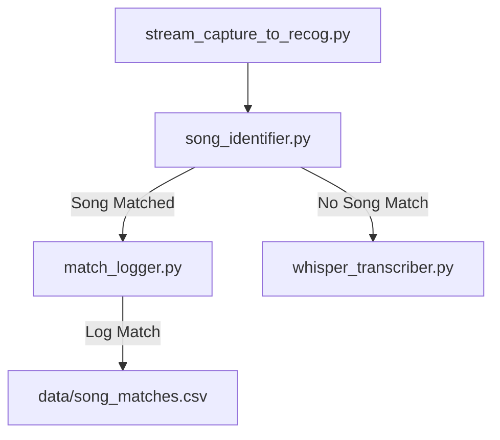

```mermaid
flowchart TD;
    A[stream_capture_to_recog.py] --> C[song_identifier.py];
    C -- Song Matched --> D[match_logger.py];
    C -- No Song Match --> F[whisper_transcriber.py];
    D -- Log Match --> G[data/song_matches.csv];
```
